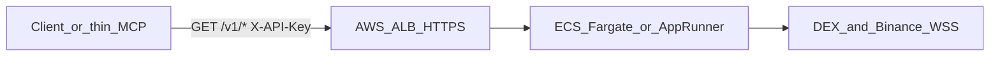

# AWS deployment: MCP HTTP bridge

What to package and upload to AWS so an **MCP HTTP bridge** (long-lived Node + `WSAggregator`) runs there with HTTPS and secrets. Your **Next.js dashboard** can stay on **Vercel**.

> **Repo note:** This guide assumes a **`mcp-bridge/server.ts`** HTTP wrapper around `WSAggregator` exists (or you restore it from git history). If the bridge is not in the tree, use **local stdio MCP** only: `npm run mcp` → [`mcp-server/index.ts`](../mcp-server/index.ts).

## Goal

Run the bridge on AWS as a **long-lived Node service** with **TLS** and a **strong API key**. The bridge serves `GET /v1/signals`, `/v1/leaderboard`, `/v1/arbitrage` (authenticated); thin MCP clients or scripts call it over HTTPS.

## What the bridge needs on disk (dependency closure)

The bridge imports `WSAggregator` from [`mcp-server/wsAggregator.ts`](../mcp-server/wsAggregator.ts), which pulls in `@/` path aliases from the root [`tsconfig.json`](../tsconfig.json). Easiest approach: **ship a slice of the repo** plus root `tsconfig.json`, run **`npm ci`**, then start with **`tsx`** from repo root.

### Include in the deploy artifact (Docker build context or zip)

| Path | Purpose |
|------|---------|
| `mcp-bridge/` | HTTP server entry (`server.ts`) |
| `mcp-server/wsAggregator.ts`, `mcp-server/binanceRef.ts` | Aggregator + Binance ref |
| `lib/formulas.ts`, `lib/noiseReduction.ts`, `lib/dexAdapters.ts`, `lib/pairs.ts` | Formulas + adapters + pair registry |
| `types/orderbook.ts` | Shared types |
| `package.json` + lockfile | `npm ci` |
| `tsconfig.json` | So `tsx` resolves `@/*` → `./*` for `lib/` |

**Not required for the bridge only:** `app/`, `components/`, `public/`, `hooks/` (Next UI). Omitting them shrinks the image; or use `.dockerignore` if you `COPY` the whole repo.

**Runtime npm packages:** `ws`, `tsx`, `typescript`, and transitive deps. `tsx` may be a **devDependency** — for production Docker either **`npm ci` without omitting dev** for this image, or promote `tsx` + `typescript` to **dependencies** in a bridge-only `package.json`.

### Example bridge command

```bash
export MCP_BRIDGE_API_KEY='long-random-secret'
npx tsx mcp-bridge/server.ts
```

Typical routes (when bridge is present): `GET /health` (unauthenticated), `GET /v1/signals`, `/v1/leaderboard`, `/v1/arbitrage` with `X-API-Key` or `Authorization: Bearer`.

## What you upload to AWS (typical pattern)

You **push one container image** (or one zip for Beanstalk).

1. **Recommended: Docker image → ECR → ECS (Fargate) or App Runner**
   - Push image to **Amazon ECR**.
   - Image: files above + `RUN npm ci` + `CMD` e.g. `npx tsx mcp-bridge/server.ts`.
   - Map load balancer **443** → container `PORT`.

2. **Alternative: Elastic Beanstalk (Node)** — zip + `Procfile` / start script.

3. **Alternative: single EC2** — same tree + **pm2** / systemd.

**Avoid Lambda-only** for this workload: many **outbound WebSockets** + **in-memory state** need a persistent process unless you redesign.

## Environment variables

Set in ECS task definition, App Runner, or inject from **Secrets Manager** / SSM.

| Variable | Notes |
|----------|--------|
| `MCP_BRIDGE_API_KEY` | **Required** for a secure bridge. Prefer **Secrets Manager**. |
| `BRIDGE_PAIR` | Optional; default `BTC/USD`. |
| `PORT` | Match platform (e.g. **8080** for ALB); align target group ↔ container. |

## Security / UX

- **HTTPS only** for clients: **ALB + ACM** (or App Runner HTTPS).
- **Security group:** inbound **443** (optional **80** → redirect to 443). No public SSH on Fargate.
- **WAF** (optional) on ALB if the API is public.
- **Rotate** `MCP_BRIDGE_API_KEY` if leaked.

## Flow



## Checklist

1. **Dockerfile** (or EB bundle): `mcp-bridge`, `mcp-server`, `lib`, `types`, `package.json`, lockfile, `tsconfig.json`.
2. **`npm ci`** in image; **CMD** `npx tsx mcp-bridge/server.ts`.
3. Push to **ECR**; run **Fargate** or **App Runner**; inject secrets.
4. **ALB + ACM** → public HTTPS URL for clients.
5. **Vercel** = dashboard only; **AWS** = bridge only (when you use this architecture).

## Related (current repo)

- [`mcp-server/index.ts`](../mcp-server/index.ts) — **stdio MCP** (local Cursor, no HTTP bridge).
- [`mcp-server/wsAggregator.ts`](../mcp-server/wsAggregator.ts) — shared aggregation logic the bridge would import.
